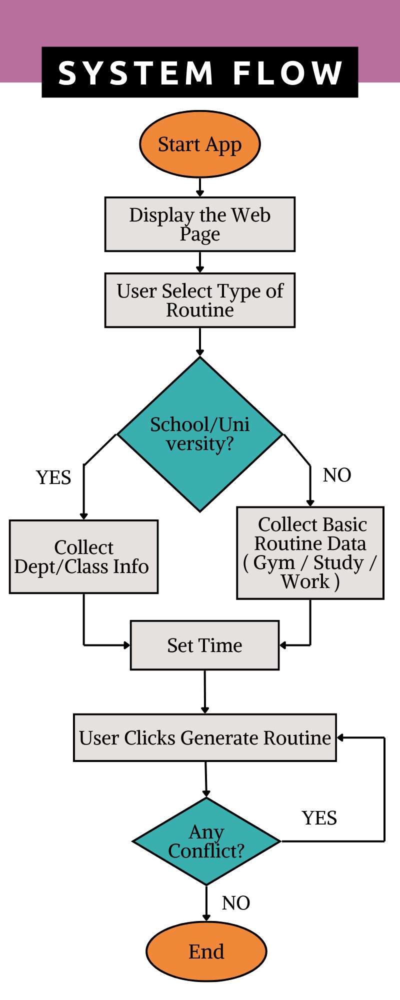

# ChronoGen_AI 

## AI-Powered Class Scheduling System

+ This application leverages ***Genetic Algorithms (GA)*** for optimized class scheduling, minimizing conflicts and efficiently assigning instructors, rooms, and time slots. 
+ Built with ***Streamlit*** for interactive user experience, it dynamically generates optimal schedules for School, University, Gym/Training, Home/Self-Study, and Work environments.

### 🔍 How It Works:

__1. Genetic Algorithm Optimization:__

* Uses evolutionary principles to optimize schedules across multiple iterations.

* Minimizes instructor, room, and time slot conflicts.

__2. Dynamic Data Mapping:__

* Automatically maps subjects to teachers and schedules time slots based on user input.

* Generates optimal room assignments and prevents double bookings.

__3. Interactive UI with Streamlit:__

* Real-time input for subjects, teachers, rooms, and projects.

* Instant schedule visualization and conflict detection.

### 🚀 Features:

- __*AI-Optimized Scheduling:*__ Avoids conflicts and maximizes resource utilization.

- __*Multi-Environment Support:*__ Customizable for school, university, work, and more.

- __*Real-Time Conflict Checking:*__ Ensures minimum or no overlap of classes or instructors.

- __*Smart & simple Scheduling:*__ Ensures a detailed but simple & structured daily plans.

